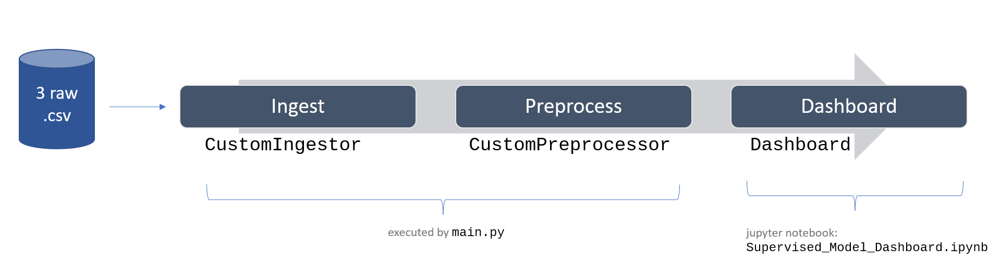
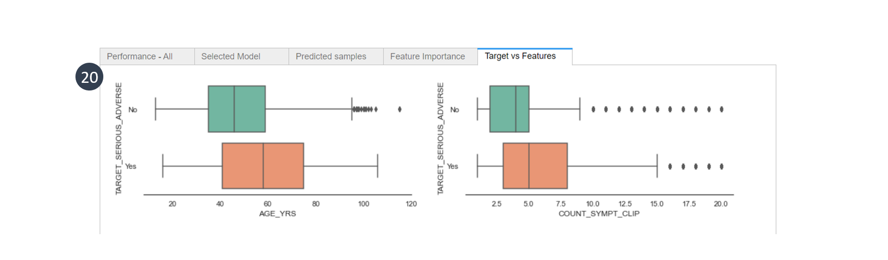

# Workflow

# Supervised Model dashboard

The Supervised Model Dashboard allows a user to quickly assess if a dataset is suitable for modelling. This dashboard was designed to display the evaluation results of a baseline supervised machine learning model, and explain some of the model predictions. The Dashboard is run from a jupyter notebook and the display is rendered via voila. 

This dashboard displays the following for a Supervised machine learning model:

**Binary classification problems**: 

- model performance scores, 
- Receiver operating characteristic curve,
- Precision-Recall curve,   
- Classification Report, 
- Confusion Matrix, 
- Model hyperparameters, 
- Sample of predicted labels with features and true labels,
- Impurity-based feature importance scores,
- Summary plot of SHapley Additive exPlanations (SHAP) values,
- Bivariate plots of Target vs Features for Top N features

**Regression problems**:

- model performance scores,
- Model hyperparameters, 
- Sample of predicted labels with features and true labels,
- Impurity-based feature importance scores,
- Summary plot of SHapley Additive exPlanations (SHAP) values,
- Bivariate plots of Target vs Features for Top N features

## Dashboard overview

*Note: The numbered labels in the screenshots correspond to each widget in the custom python `Dashboard` class. For more details on the jupyter widgets, callback functions, process flow, please refer to the [user guide](http://htmlpreview.github.io/?https://github.com/py3lee/projects/blob/main/supervised_ml_dashboard/user_guide/Supervised%20Model%20Dashboard.html) or (`user_guide`>`Supervised_Model_Dashboard.md`).* 

## Setup

The Dashboard was written in the python programming language, and runs from a Jupyter notebook. The display is rendered using voila.  

After setting up the [virtual environment](https://github.com/py3lee/projects/blob/main/supervised_ml_dashboard/user_guide/Supervised_Model_Dashboard.md#environmentyml-file), open the [Supervised Model Dashboard notebook](notebook/Supervised_Model_Dashboard.ipynb) (`notebook` > `Supervised_Model_Dashboard.ipynb`)

Run all cells to display the dashboard. 

## User guide

Check out the detailed [user guide](http://htmlpreview.github.io/?https://github.com/py3lee/projects/blob/main/supervised_ml_dashboard/user_guide/Supervised%20Model%20Dashboard.html) or (`user_guide`>`Supervised_Model_Dashboard.md`) for details on the configuration settings, setup files, step-by-step walkthrough of all the displayed content, as well as the process flows for the classes. 

## EDA 

See the respective [Exploratory Data Analysis (EDA) notebooks](notebook/EDA) (`notebook` > `EDA`) for the rationale and justification of the preprocessing steps in the [`CustomIngestor`](src/preprocess/custom_ingestor.py) and [`CustomPreprocessor`](src/preprocess/custom_preprocessor.py) python classes.  