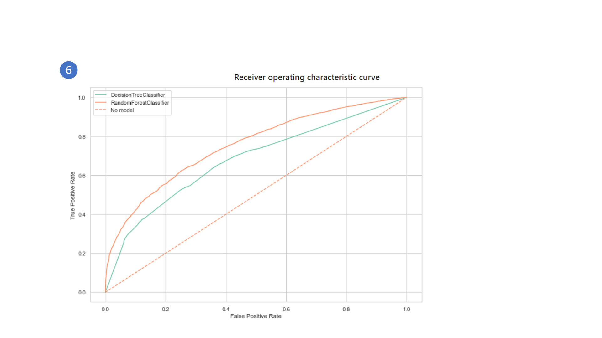
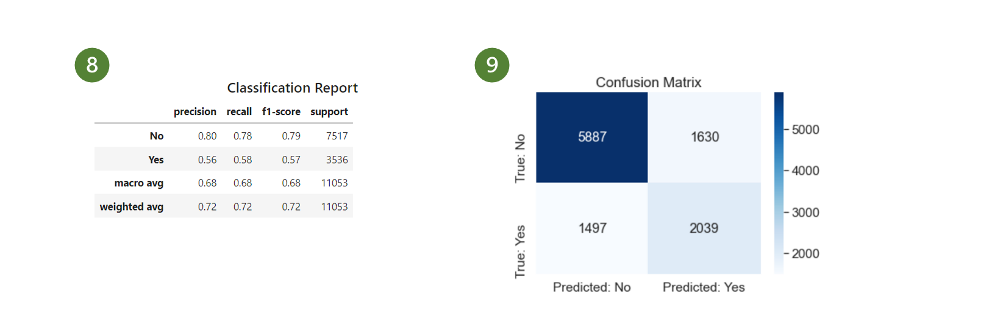
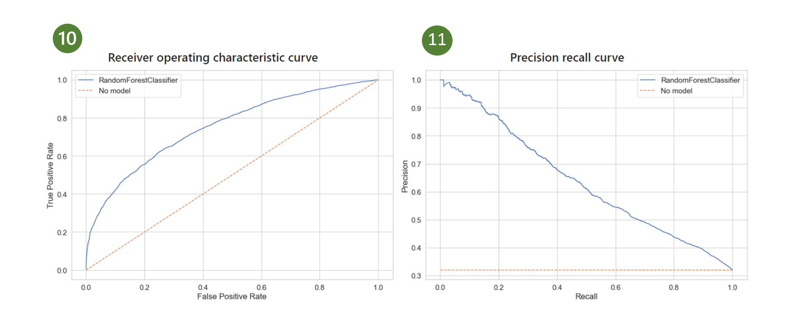
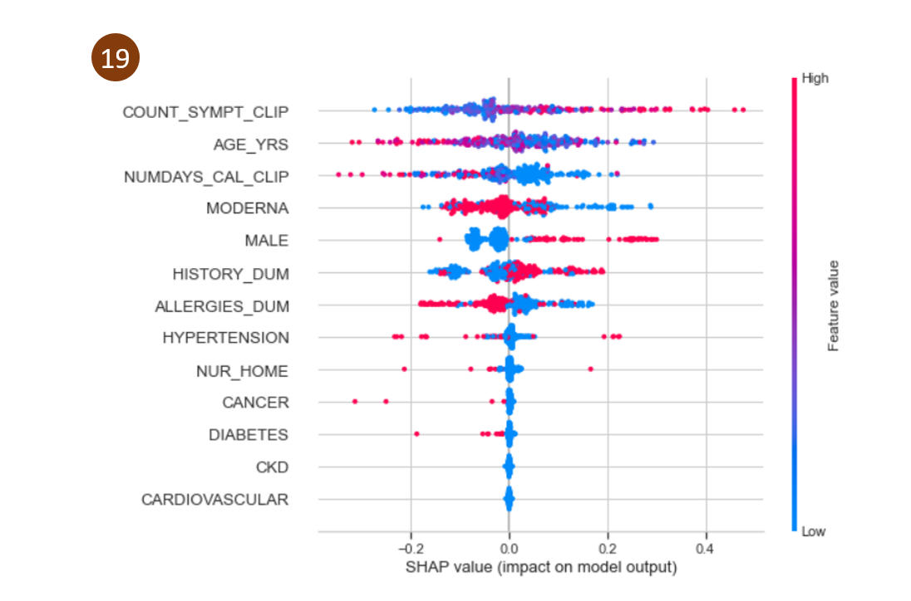
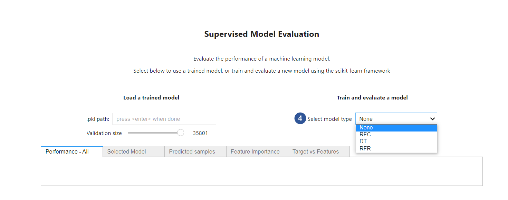
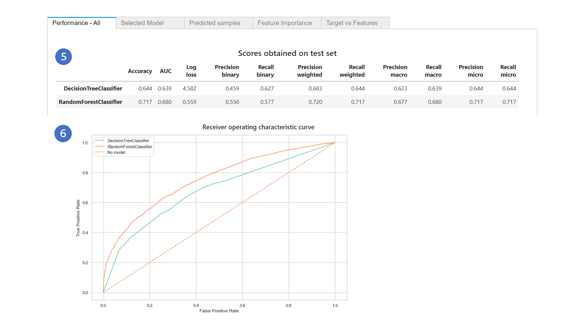
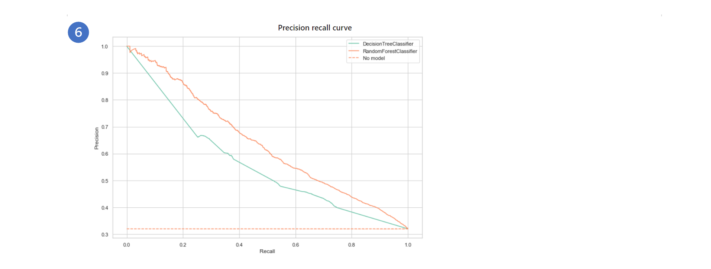
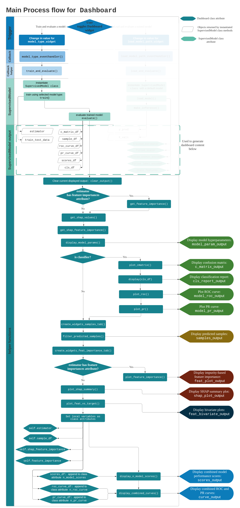
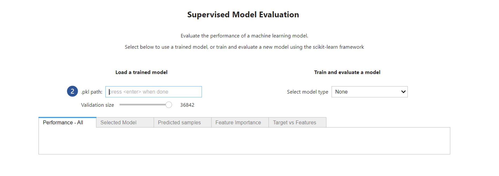
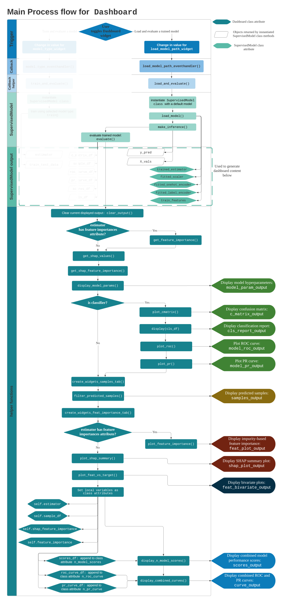

---
- [**Workflow**](#workflow)
- [**Supervised Model dashboard**](#supervised-model-dashboard)
  - [Model choices available](#model-choices-available)
  - [Setup](#setup)
    - [Jupyter notebook](#jupyter-notebook)
    - [Required python module scripts:](#required-python-module-scripts)
    - [Configuration](#configuration)
    - [environment.yml file](#environmentyml-file)
  - [Quick start](#quick-start)
- [**Dashboard overview**](#dashboard-overview)
  - [Mapping of widgets to displayed output and callbacks](#mapping-of-widgets-to-displayed-output-and-callbacks)
- [**Overall process flow**](#overall-process-flow)
- [**Main widget events**](#main-widget-events)
  - [1. Train and evaluate a model](#1-train-and-evaluate-a-model)
    - [Event 1 trigger](#event-1-trigger)
      - [Performance-All](#performance-all)
      - [Selected Model](#selected-model)
      - [Predicted samples](#predicted-samples)
      - [Feature Importance tab](#feature-importance-tab)
        - [Bar chart of features and impurity-based feature importance scores](#bar-chart-of-features-and-impurity-based-feature-importance-scores)
        - [Summary plot of SHapley Additive exPlanations (SHAP) values](#summary-plot-of-shapley-additive-explanations-shap-values)
      - [Target vs Features](#target-vs-features)
    - [Event 1 Overall flow](#event-1-overall-flow)
      - [Output_widgets](#output_widgets)
      - [Underlying Data Frames for content display](#underlying-data-frames-for-content-display)
        - [Data Frames generated from  `evaluate()` method of `SupervisedModel` class](#data-frames-generated-from--evaluate-method-of-supervisedmodel-class)
        - [Data Frames/matrices generated from functions defined in `dashboard_helpers.py`](#data-framesmatrices-generated-from-functions-defined-in-dashboard_helperspy)
          - [feature_importance](#feature_importance)
          - [shap_values](#shap_values)
        - [Data Frames generated from multiple models](#data-frames-generated-from-multiple-models)
    - [SupervisedModel class in focus: train and evaluate](#supervisedmodel-class-in-focus-train-and-evaluate)
  - [2. Load and evaluate a trained model](#2-load-and-evaluate-a-trained-model)
    - [Event 2 trigger](#event-2-trigger)
    - [Event 2 Overall flow](#event-2-overall-flow)
    - [SupervisedModel class:load and evaluate](#supervisedmodel-classload-and-evaluate)
- [**Future development**](#future-development)
  - [Multi-class classification problems](#multi-class-classification-problems)
  - [Adding new estimators](#adding-new-estimators)
    - [Adding non-probabilistic classifiers](#adding-non-probabilistic-classifiers)
  - [Explaining individual predictions](#explaining-individual-predictions)
  - [Regression problems](#regression-problems)
  - [One hot encoding and subsequent decoding](#one-hot-encoding-and-subsequent-decoding)

----

# Workflow


# Supervised Model dashboard


This dashboard displays the following for a Supervised machine learning model:


**Binary classification problems**: 

- model performance scores, 
- Receiver operating characteristic curve,
- Precision-Recall curve,   
- Classification Report, 
- Confusion Matrix, 
- Model hyperparameters, 
- Sample of predicted labels with features and true labels,
- Impurity-based feature importance scores,
- Summary plot of SHapley Additive exPlanations (SHAP) values,
- Bivariate plots of Target vs Features for Top N features


**Regression problems**:

- model performance scores,
- Model hyperparameters, 
- Sample of predicted labels with features and true labels,
- Impurity-based feature importance scores,
- Summary plot of SHapley Additive exPlanations (SHAP) values,
- Bivariate plots of Target vs Features for Top N features


## Model choices available


- Classifiers:

  - "DT" : DecisionTreeClassifier (*scikit-learn*)
  - "RFC" : RandomForestClassifier (*scikit-learn*)
  - "Auto-Classification" (*AutoML*)

- Regressors:

  - "RFR": RandomForestRegressor (*scikit-learn*)

  - "Auto-Regression" (*AutoML*)

    

For estimators under the scikit-learn framework, hyperparameters have to be specified by the user in a configuration file prior to training the model.  

If the "Auto-Classification" or "Auto-Regression" options are chosen, model tuning and the best estimator that minimises the specified loss will be determined using the [FLAML - Fast and Lightweight AutoML](https://github.com/microsoft/FLAML) package. AutoML settings have to be stated in the configuration file prior to choosing this option. See [configuration](#Configuration) for further details. 


> :warning:This Dashboard is an initial release version, which is only valid for:
>
> - binary classification problems with *numeric* features,
> - regression problems with *numeric* features 
>
> Multi-class classification problems, inclusion of more scikit-learn estimators, encoding of non-numeric features (with subsequent decoding), processing of datetime features will be slated for [future development](#Future-development). 


## Setup


### Jupyter notebook


This Dashboard displays from a Jupyter notebook. 

Open the Supervised Model Dashboard notebook by navigating to `notebook` > `Supervised_Model_Dashboard.ipynb`

Run all cells to display the dashboard. 


### Required python module scripts:


```python
voila_dashboard.py
dashboard_helpers.py
supervised_model_class.py

config.py # Example config file to be imported as a module when training a model
```


### Configuration

A python configuration file is required when training a model using the Dashboard. The python configuration file would have to be imported as a module at the start of the notebook, or have the following attributes: 


1. `TEST_SIZE` (float): proportion of dataset to be used as the test set to evaluate model performance
2. `SEED` (int): random seed value
3. `SCALER` (str, or `None`): Type of scaler to use to scale features prior to training a model. 
   - Options: `'standard`', `'robust'`
   
   - Will default to MinMax scaling if other strings are stated (eg. `'minmax'`/`'min_max'` etc)
   - If`None`, no scaling of features will be performed. 
4. `ONEHOT_COLS` (list): list of feature names to be one hot encoded
6. `PARAMS`(dict): dictionary of model hyperparameters to use when training a model under the scikit-learn framework
6. `AUTOML_SETTINGS`(dict): dictionary of automl configuration settings when "Auto-Classification" or "Auto-Regression" options are chosen. Please refer to [FLAML](https://github.com/microsoft/FLAML) for further details. 


The model/estimator type can be selected via the dasboard widget - see [Dashboard Overview](#Dashboard-Overview) for more details. 


*Example*:

```
TEST_SIZE = 0.2
SEED = 2
SCALER = None
ONEHOT_COLS = []

PARAMS = {
    'class_weight': 'balanced',
    'max_features': 'sqrt',
    'max_depth': 50,
    'min_samples_leaf': 2,
    'random_state': 2
}

AUTOML_SETTINGS = {
    "time_budget": 30,  # in seconds
    "metric": 'roc_auc',
    "task": 'classification',
    "log_file_name": "../logs/automl.log",
}
```


### environment.yml file

(for `Dashboard` class)

```
name: sup_dashboard
channels:
  - conda-forge
  - defaults
dependencies:
  - anyio=3.3.2
  - argcomplete=1.12.3
  - argon2-cffi=20.1.0
  - async_generator=1.10
  - attrs=21.2.0
  - backcall=0.2.0
  - backports=1.0
  - backports.functools_lru_cache=1.6.4
  - bleach=4.1.0
  - ca-certificates=2021.5.30
  - category_encoders=2.2.2
  - certifi=2021.5.30
  - cffi=1.14.6
  - cloudpickle=2.0.0
  - colorama=0.4.4
  - cycler=0.10.0
  - debugpy=1.4.1
  - decorator=5.1.0
  - defusedxml=0.7.1
  - entrypoints=0.3
  - freetype=2.10.4
  - idna=3.1
  - importlib-metadata=4.8.1
  - importlib_metadata=4.8.1
  - intel-openmp=2021.3.0
  - ipykernel=6.4.1
  - ipython=7.28.0
  - ipython_genutils=0.2.0
  - ipywidgets=7.6.5
  - jbig=2.1
  - jedi=0.18.0
  - jinja2=3.0.1
  - joblib=1.0.1
  - jpeg=9d
  - jsonschema=4.0.1
  - jupyter_client=6.1.12
  - jupyter_core=4.8.1
  - jupyter_server=1.7.0
  - jupyterlab_pygments=0.1.2
  - jupyterlab_widgets=1.0.2
  - kiwisolver=1.3.2
  - lcms2=2.12
  - lerc=2.2.1
  - libblas=3.9.0
  - libcblas=3.9.0
  - libdeflate=1.7
  - liblapack=3.9.0
  - libpng=1.6.37
  - libsodium=1.0.18
  - libtiff=4.3.0
  - libzlib=1.2.11
  - llvmlite=0.36.0
  - lz4-c=1.9.3
  - m2w64-gcc-libgfortran=5.3.0
  - m2w64-gcc-libs=5.3.0
  - m2w64-gcc-libs-core=5.3.0
  - m2w64-gmp=6.1.0
  - m2w64-libwinpthread-git=5.0.0.4634.697f757
  - markupsafe=2.0.1
  - matplotlib-base=3.4.3
  - matplotlib-inline=0.1.3
  - mistune=0.8.4
  - mkl=2020.4
  - msys2-conda-epoch=20160418
  - nbclient=0.5.4
  - nbconvert=6.2.0
  - nbformat=5.1.3
  - nest-asyncio=1.5.1
  - notebook=6.4.4
  - numba=0.53.1
  - numpy=1.21.2
  - olefile=0.46
  - openjpeg=2.4.0
  - openssl=1.1.1l
  - packaging=21.0
  - pandas=1.3.3
  - pandoc=2.14.2
  - pandocfilters=1.5.0
  - parso=0.8.2
  - patsy=0.5.2
  - pickleshare=0.7.5
  - pillow=8.3.2
  - pip=21.2.4
  - prometheus_client=0.11.0
  - prompt-toolkit=3.0.20
  - pycparser=2.20
  - pygments=2.10.0
  - pyparsing=2.4.7
  - pyrsistent=0.17.3
  - python=3.7.10
  - python-dateutil=2.8.2
  - python_abi=3.7
  - pywin32=301
  - pywinpty=1.1.4
  - pyzmq=22.3.0
  - scikit-learn=1.0
  - scipy=1.7.1
  - seaborn=0.11.2
  - seaborn-base=0.11.2
  - send2trash=1.8.0
  - setuptools=58.0.4
  - shap=0.39.0
  - six=1.16.0
  - slicer=0.0.7
  - sniffio=1.2.0
  - sqlite=3.36.0
  - statsmodels=0.13.0
  - tbb=2020.2
  - terminado=0.12.1
  - testpath=0.5.0
  - threadpoolctl=3.0.0
  - tk=8.6.11
  - tornado=6.1
  - tqdm=4.62.3
  - traitlets=5.1.0
  - typing_extensions=3.10.0.2
  - ucrt=10.0.20348.0
  - vc=14.2
  - voila=0.2.15
  - vs2015_runtime=14.29.30037
  - wcwidth=0.2.5
  - webencodings=0.5.1
  - websocket-client=0.57.0
  - wheel=0.37.0
  - widgetsnbextension=3.5.1
  - winpty=0.4.3
  - xz=5.2.5
  - zeromq=4.3.4
  - zipp=3.6.0
  - zlib=1.2.11
  - zstd=1.5.0
  - pip:
    - catboost==1.0.0
    - flaml==0.6.5
    - lightgbm==3.2.1
    - plotly==5.3.1
    - python-graphviz==0.17
    - pytz==2021.3
    - tenacity==8.0.1
    - xgboost==1.3.3
```


## Quick start

Instantiate `Dashboard` class from`voila_dashboard.py` in an empty jupyter notebook after importing the required python modules and setting up the virtual environment. 


*Example*:

```
dashboard = Dashboard(
    df = df,
    target = 'TARGET_SERIOUS_ADVERSE',
    n_samples = 20,
    cfg = cfg
)
```


Required arguments:

1. `df` - cleaned / preprocessed dataset as a pandas Data Frame
2. `target` - name of the target variable/column in the dataset 


*Optional arguments*:

- `n_samples` : number of randomly sampled rows  to manually inspect predictions with true labels and features in Predicted samples tab (see annotated label 16 below).  
- `cfg`: python configuration file to input required variables for training and evaluating a model. Not required if the user is loading a trained model for evaluation purposes.  See [Configuration](#Configuration) section for more details. 


# Dashboard overview














## Mapping of widgets to displayed output and callbacks


# Overall process flow 


# Main widget events

The Dashboard will only display content after the trigger of a main widget event within the dashboard. 

There are **two** (2) main widget events in this dashboard:


1. **Train and evaluate a model** 
2. **Load and evaluate a trained model** 


The 2 main widget event process flows will be discussed separately below:


## 1. Train and evaluate a model 

A python configuration file is required when training a model using the Dashboard. The configuration file would have to be imported as a module at the start of the notebook. See [Configuration](#Configuration) above on the required configuration variables. 


### Event 1 trigger

The `train and evaluate` workflow is triggered when the user selects a model type from the `model_type_widget` dropdown box:




Model types available for selection:

| Estimator type | Option in dropdown box |                          Estimator                           |
| :------------: | :--------------------: | :----------------------------------------------------------: |
|   Classifier   |          'DT'          |           DecisionTreeClassifier (*scikit-learn*)            |
|   Classifier   |         'RFC'          |           RandomForestClassifier (*scikit-learn*)            |
|   Classifier   | 'Auto-Classification'  | AutoML (from  [FLAML](https://github.com/microsoft/FLAML) package) |
|   Regressor    |         'RFR'          |           RandomForestRegressor  (*scikit-learn*)            |
|   Regressor    |   'Auto-Regression'    | AutoML (from  [FLAML](https://github.com/microsoft/FLAML) package) |


Each output to be displayed in the dashboard is captured by an [`Output` widget](https://ipywidgets.readthedocs.io/en/latest/examples/Output%20Widget.html). These `output` widgets capture and display stdout, stderr and rich output generated by IPython. The output to be displayed is directed to the respective `output` widgets using a context manager.  


There are **11** output widgets for this main widget event. 


The names of the output widgets are listed in [Dashboard overview](#Dashboard overview) above. The output widgets are then placed in their respective containers, and organized into the following five (5) different dashboard tabs:


- Performance-All, 
- Selected Model, 
- Predicted Samples, 
- Feature Importance, 
- Target vs Features


#### Performance-All 

The 'Performance-All' tab displays the overall performance scores for the model. For classification problems, the combined Receiver Operating Characteristic (ROC) curve and Precision Recall (PR) curves will also be displayed. 


If multiple models are sequentially trained, the underlying Data Frames from each of the model types will be appended to the class attributes `n_model_scores`, `n_roc_curve`, `n_pr_curve`.  The concatenated Data Frames will then be used for the display of the combined model scores and combined ROC and PR curves in this tab. 


An example display is shown below:








> :warning: For regressors, the `curve_output` widget (labeled 6 above) for the combined Receiver Operating Curve and Precision recall curves will be a blank display.


#### Selected Model

The Selected Model tab displays the following:

- Training set size 

- Test set size 

- Hyperparameters used for training the model 

- For classifiers, the following will also be displayed:

  - Classification report

  - Confusion matrix 

  - Receiver Operating Characteristic (ROC) curve for that particular selected model. 
    - The output for this curve is based on the `roc_curve_df` Data Frame generated from that particular model. This `roc_curve_df` will then be appended to the class attribute `n_roc_curve` at the end of the event (which will subsequently be used to display the combined curve in the Performance-All tab). 

      

  - Precision Recall (PR) curve for that particular selected model. 
    
    - The output for this curve is based on the `pr_curve_df` Data Frame generated from that particular model. This `pr_curve_df` will then be appended to the class attribute `n_pr_curve` at the end of the event (which will subsequently be used to display the combined curve in the Performance-All tab). 


An example display is shown below:


> :warning: ROC and PR curves are only valid for binary classification problems at this stage. Only the predicted probabilites of the positive class are used in the calculation of the True Positive Rate and False Positive rate for the ROC curve, and the Precision and Recall values for the PR curve at different thresholds. 
>
> To reduce the risk of displaying erroneous output at this inital stage of development, the `evaluate()` method in the `SupervisedModel` class will return `None` for the keys `roc_curve_df` and `pr_curve_df` in the `results` dictionary if there are more than 2 classes in the target variable.
>
> Caution should also be exercised when adding in non-probabilistic estimators such as [SVM](https://scikit-learn.org/stable/modules/generated/sklearn.svm.SVC). See the [future development](#Future development) section for further information.


#### Predicted samples

The Predicted samples tab displays a random sample of the predicted labels and the 'ground truth'. For classification problems, this random sample is stratified using the proportions of the true labels in the combined test set. This combined test set consists of all features used in the test set,`X_test`, the true labels,`y_test`, and predicted labels,`y_pred`. 


The user can toggle the respective widgets to filter the number of displayed rows, features to display, true label classes, as well as predicted label classes.  


An example display is shown below:


> :warning: Please kindly note that this is only valid for **numeric** features at this current stage of development. 
>


#### Feature Importance tab

The Feature Importance tab displays the following:

1. Bar chart of features and impurity-based feature importance scores
2. Summary plot of SHapley Additive exPlanations (SHAP) values


##### Bar chart of features and impurity-based feature importance scores

This feature importance score is computed as the mean and standard deviation of accumulation of the impurity decrease within each tree [(Mean Decrease in Impurity)](https://scikit-learn.org/stable/auto_examples/ensemble/plot_forest_importances.html#feature-importance-based-on-mean-decrease-in-impurity). The bar chart is sorted in descending order of feature importance scores. 


The user can toggle the Top N features slider bar (`limit_plot_feat_widget`, labeled 17 below in the image) to limit the number of features to be displayed. This widget is connected to the number of bivariate plots to be displayed in the ['Target vs Features' tab](#Target-vs-Features). By default, all features will be displayed. 


> :warning: This bar chart should be interpreted in the context of the following limitations: 
>
> 1. The statistics used for computing [impurity-based feature importance scores](https://scikit-learn.org/stable/modules/ensemble.html#random-forest-feature-importance) are derived from the training dataset, and therefore do not necessarily inform the user on which features are the most important to make good predictions on the held-out dataset.  
> 2.  These feature importance scores favor high cardinality features. 


##### Summary plot of SHapley Additive exPlanations (SHAP) values

The SHAP values calculated in this tab are based on KernelSHAP, which is a [kernel-based estimation approach for Shapley values](https://shap-lrjball.readthedocs.io/en/latest/generated/shap.KernelExplainer.html). This method uses a special weighted linear regression to compute the importance of each feature. The computed importance values are Shapley values from game theory and coefficients from a local linear regression. 


The [SHAP Summary Plot](https://christophm.github.io/interpretable-ml-book/shap.html#shap-summary-plot) combines feature importance with feature effects. This allows the user to get a sense of the relationship between the value of a feature and the impact on the prediction. 

- SHAP feature importance scores are measured using the mean absolute Shapley values. 
- Each point on the summary plot is a Shapley value for a feature and an instance. 
- The position on the y-axis is determined by the feature, and the position on the x-axis is determined by the Shapley value. 
- Overlapping points are jittered in the y-axis direction.
- The color represents the value of the feature from low to high. 
- Features are ordered according to their importance 


> :warning:  SHAP values take a long time to compute. By default, a random sample of 100 from the training set will be used to compute the expected value, and a random sample of 100 from the test set will be explained. The user can also use all of the X_train to calculate expected values, and explain all of X_test.
>


#### Target vs Features

The 'Target vs Features' tab displays bivariate plots of the target variable against each feature in the main Data Frame`df`. 


- The order of display is determined by the SHAP feature importance scores for each feature. Features with higher mean absolute SHAP importance scores are displayed first. 

- The number of bivariate plots to be displayed in this tab are determined by the  Top N features slider bar (`limit_plot_feat_widget`, labeled 17 in [Dashboard Overview](#Dashboard overview)). By default, all features will be plotted. 

- The data used to generate the plots are the features and target variables in the Data Frame `df` which is used to instantiate the `Dashboard` class.

  

An example display is shown below:


> :warning: Due to the HTML formatting within the container, when there are fewer features, the plots are automatically adjusted to fill up the container space. This may result in distorted plots which are stretched vertically. 
>
> 
>
> If one-hot encoding is used to encode categorical features, there would be a mismatch in the number of features and names of the features to be displayed. This is due to the following: 
>
> - The order of display of each plot is determined by the SHAP feature importance scores
>
> - These feature importance scores are extracted from the trained estimator. Each one-hot encoded feature would have separate importance scores that are difficult to re-combine together. 
> 
> - However, the data used to generate the plots are from the Data Frame `df` used to instantiate the `Dashboard` class. This is because there would be limited utility in displaying bivariate plots of only the test set, or of the target vs one-hot encoded features; such plots may obscure the underlying relationships between the target and features.
> 
>   
> 
>Therefore, when one-hot encoding is performed for categorical features, there would be a mismatch between (1) the number of features used by the trained model, (2) name of features used by the trained model, and (3) the features present in the Data Frame `df` that is used to instantiate the `Dashboard` class. This mismatch in the number and names of the features would results in errors in this tab display. 


### Event 1 Overall flow 





The main event for 'train and evaluate' a machine learning model is triggered by a change in the `model_type_widget`(see [Event trigger](#Event-1-trigger)), which then involves the callback function `model_type_eventhandler()`. This callback function first executes `train_and_evaluate()` to generate the required content to be displayed in the dashboard for the selected model.  


#### Output_widgets

Each output to be displayed in the dashboard is captured by their respective [`Output` widgets](https://ipywidgets.readthedocs.io/en/latest/examples/Output%20Widget.html). The names and location of these output widgets on the dashboard are listed in the [Dashboard Overview](#Dashboard-overview).

These `output` widgets capture and display stdout, stderr and rich output generated by IPython. The output to be displayed is directed to the respective `output` widgets using a context manager.  

The content to be displayed by each widget are based on their respective underlying Data Frames. 

- For example, to display the Classification report (*labeled as 8 in [Selected Model tab](#Selected Model)*) that is captured by the `cls_report_output` widget, the underlying Data Frame for the classification report, `cls_df`, has to be generated by the `evaluate()` method of the `SupervisedModel` class. 


#### Underlying Data Frames for content display


##### Data Frames generated from  `evaluate()` method of `SupervisedModel` class

To generate the required Data Frames to be used for the display of output for the selected model, `train_and_evaluate()` uses the `SupervisedModel` class from `supervised_model_class.py` file. The `train()` method is first evoked to train the model, and then the `evaluate()` method is used to obtain **six** (6) Data Frames that will form the basis of the content for the dashboard: 


- `sample_df`: Data Frame of a sample of the predicted labels, true labels and features in the test set

- `c_matrix_df`: Confusion Matrix Data Frame 

- `roc_curve_df`: Data Frame of false postive rates, true positive rates for different thresholds for a classifier

- `pr_curve_df`: Data Frame of precision and recall values for different thresholds for a classifier, as well as the proportion of the positive class ('proportion_1') in the test set. 

- `cls_df`: Classification Report Data Frame 

- `scores_df`: Data Frame of model performance scores. 

  - For classifiers, the following performance scores will be obtained:

    - **Accuracy**: Classification accuracy

    - **AUC**: Area Under the Receiver Operating Characteristic Curve (ROC AUC) from prediction scores

    - **Log loss**: Logistic loss or cross-entropy loss

    - **Precision binary**: Precision for the positive class 

    - **Recall binary**: Recall for the positive class 

    - **Precision weighted**: Average precision for each class, weighted by support (the number of true instances for each label)

    - **Recall weighted**:  Average recall for each class, weighted by support (the number of true instances for each label)

    - **Precision macro**: The unweighted mean of precision for each class. Does not take label imbalance into account.

    - **Recall macro**: The unweighted mean of recall for each class. Does not take label imbalance into account.

    - **Precision micro**: Precision calculated by counting the total true positives, false negatives and false positives for each class.

    - **Recall micro**: Recall calculated by counting the total true positives, false negatives and false positives for each class

      

  - For regressors, the following scores will be obtained:

    - **Explained Variance**: Explained variance regression score. 
    - **R2**: Coefficient of determination regression score. This is the unadjusted R² without correcting for bias in sample variance of y.
    - **Mean Absolute Error**: Mean absolute error, a risk metric corresponding to the expected value of the absolute error loss or l1-norm loss.
    - **Mean Squared Error**: Mean square error, a risk metric corresponding to the expected value of the squared (quadratic) error or loss.
    - **Root Mean Squared Error**: Root Mean Squared Error 


The Data Frames are then used by the respective helper functions from `dashboard_helpers.py` to generate the respective output/plots that are captured by the respective output widgets, as shown in the [Overall flow](#Event-1-Overall-flow).


##### Data Frames/matrices generated from functions defined in `dashboard_helpers.py`


Within `train_and_evaluate()`, the following helper functions from `dashboard_helpers.py` are then called next to generate the underlying Data Frames required to display content in the [Feature Importance tab](#Feature-Importance-tab):

- `get_feature_importance()`: generates the DataFrame `feature_importance`
- `get_shap_values()`:  generates the matrix `shap_values`


###### feature_importance

This Data Frame is composed of the impurity-based feature importance scores for each feature used during model training. 

- These impurity-based scores are extracted from the (trained) `estimator` returned by the `train()` method from the `SupervisedModel` class. 

- This Data Frame is then used by `plot_feature_importance()` helper function to display the seaborn plot captured by the `feat_plot_output` widget (see label 18 in [Dashboard Overview](#Dashboard-overview)).

  

> :warning: This can only be used for tree-based estimators. Non-tree based estimators within the scikit-learn framework do not have the attribute `feature_importances_` and will result in a blank display. 


###### shap_values

For classification problems, the shap_values would be a list of size n_classes (number of classes). Each element of this list is an array/matrix of size [n_samples, n_features], which corresponds to the SHAP (SHapley Additive exPlanations) values for the respective class. There is one row per data instance and one column per feature. 

For regression models there would only be a single matrix of shap values of size [n_samples, n_features]. 


This is calculated using the shap KernelExplainer, which is a model-agnostic, [kernel-based estimation approach for Shapley values](https://shap-lrjball.readthedocs.io/en/latest/generated/shap.KernelExplainer.html). The KernelExplainer uses the (trained) `estimator` returned by the `train()` method from the `SupervisedModel` class.


- By default, all of `X_train` will be used to *estimate expected values* to explain predictions.

  - `X_train` is a Data Frame created using the list of features used during model training (`train_features`), and the array of features used during training (`X_train`).

  - This array `X_train` is contained within the key `"X_train"` in the dictionary `train_test_data` that is returned by the `train()` method of the `SupervisedModel` class after a model is trained. 

    

- By default, all of `X_test` will be *explained*. 

  - `X_test` is a Data Frame created using the list of features used during model training  (`train_features`), and the array of test set features created after train test split (`X_test`).
  - This array `X_test` is contained within the key `"X_test"` in the dictionary `train_test_data` that is returned by the `train()` method of the `SupervisedModel` class after a model is trained. 


The array of SHAP values and `X_test` are then used by `plot_shap_summary()` to display the SHAP summary plot that is captured by the `shap_plot_output` widget (see label 19 in [Dashboard Overview](#Dashboard-overview)).


> :warning:SHAP values take a long time to calculate. To reduce computing time, the user can select a sample of X_train to use in the calculation of  expected values, and a sample of X_test to explain predictions for. This can be accessed using the `n_samples` optional argument in `get_shap_values()` and `plot_shap_summary()` . 


##### Data Frames generated from multiple models


If multiple models are sequentially trained, the Data Frames `scores_df`, `roc_curve_df`, `pr_curve_df`  from each of the model types will be appended to the class attributes `n_model_scores`, `n_roc_curve`, `n_pr_curve` respectively.  


The concatenated Data Frames will then be used for the display of the combined model performance scores. For classifiers, the combined ROC and PR curves will also be displayed in the [Performance-All](#Performance-All) tab. The `dashboard_helpers.py` functions `plot_roc()` and `plot_pr()` are called to plot the respective ROC and PR curves in this tab. 


The following is a summary of the Data Frame, associated class attribute, and output widget:

|   Data Frame   | Appended to class attribute: |  Output widget  | Label in [Dashboard Overview](#Dashboard-overview) |
| :------------: | :--------------------------: | :-------------: | :------------------------------------------------: |
|  `scores_df`   |       `n_model_scores`       | `scores_output` |                         5                          |
| `roc_curve_df` |        `n_roc_curve`         | `curve_output`  |                         6                          |
| `pr_curve_df`  |         `n_pr_curve`         | `curve_output`  |                         6                          |

 

### SupervisedModel class in focus: train and evaluate


The above image shows the associated methods and helper functions of the `SupervisedModel` class that are involved to generate the required **six** (6) Data Frames that make up the content of the dashboard. Functions from the scikit-learn framework are used to generate the associated model scores. 


## 2. Load and evaluate a trained model 


### Event 2 trigger

The `load and evaluate` workflow is triggered when the user types in a .pkl file path into the `load_model_path_widget` text box, and hits [`enter`].





> :warning: The .pkl file should be a dictionary with the following keys:
>
> - `'trained_estimator'`: trained estimator object from the scikit-learn framework.
> - `'fitted_scaler'`: scaler fitted to the features in the training set, which will subsequently be used to transform the inference features.
> - `'onehot_encoder'`: one-hot encoder fitted to the features in the training set, which will subsequently be used to transform inference features.
> - `'label_encoder'`: label encoder fitted to the target in the training set, which will subsequently be used to:
>   -  (1) transform the true labels of the target (`y_true`) in the Data Frame used to instantiate the `Dashboard` class (`df`). `y_true` will be used by the `evaluate()` method of the `SupervisedModel` class to obtain model performance scores and other required Data Frames for the dashboard display. 
>   - (2) decode/`inverse_transform` the predicted labels during the evaluation phase. 
> - `'train_features'`: list of feature columns used when the model was trained. 
>   - This is used to check if the features in the inference set are the same as those used for model training. An exception will be raised if there is a mismatch in the features used for model training (`train_features`) and those used for inference (`inference_features`). 


### Event 2 Overall flow 





The main event for 'Load and evaluate a trained model' is triggered when the user types in a .pkl file path into the `load_model_path_widget` text box, and hits [`enter`] (see [Event trigger](#Event-2-trigger)). The callback function  triggered by this widget is `load_model_path_eventhandler()`, which executes the helper function `load_and_evaluate()`. `load_and_evaluate()` will then generate the required content to be displayed in the dashboard for the selected model.  


The displayed output are the same as the first main widget event, [Train and evaluate a model](#1-train-and-evaluate-a-model). However, to obtain the content for the dashboard, `load_and_evalute()` will first perform the following:


- instantiate the `SupervisedModel` class with a default model (DecisionTreeClassifier),

- invoke the `load_model()` method of the `SupervisedModel` class to obtain the (trained) `estimator` and the other required scalers and encoders used during model training. 
  - These variables are automatically set as class attributes within the instantiated `SupervisedModel` class. Further details are listed below in the process flow for [`SupervisedModel` class: load and evaluate](#SupervisedModel-class:-load-and-evaluate).
- Obtain `y_true` from the Data Frame, `df` , that was used to instantiate the `Dashboard` class, and perform any required label encoding. 
- invoke the `make_inference()` method of the `SupervisedModel` class to obtain the predicted labels, `y_pred` and scaled/transformed features, `X_vals`,
  - `X_vals`, `y_true`, and`y_pred` will then be used as arguments for the `evaluate()` method to obtain the **six** (6) Data Frames that are required to generate the content for the dashboard. 


The generated Data Frames are the same as those detailed in the 'train and evalute' main widget event, under the section [Underlying Data Frames for content display](#Underlying-Data-Frames-for-content-display). The only other difference between these 2 main widget events is that instead of using `X_train` and `X_test` to obtain the [shap values](#shap_values), all of `X_vals` will be used to *estimate the expected values*, and all of `X_vals` will be explained (seen as input for `get_shap_values()` and `plot_shap_summary()` in the above [Event 2 Overall Flow](#Event-2-Overall-flow) chart). 


### SupervisedModel class:load and evaluate


The above image shows the associated methods and helper functions of the `SupervisedModel` class that are involved to generate the required **six** (6) Data Frames that are required for the content of the dashboard. Functions from the scikit-learn framework are used to generate the associated model performance scores. 


# Future development 

This Dashboard is an initial release version, which is only valid for:

- binary classification problems with *numeric* features,
- regression problems with *numeric* features 


There are many other various enhancements that the creator would have loved to experiment with. However, due to time constraints, it is unfortunate that they can only be discussed in this section. It is hoped that with these enhancements, this dashboard would eventually become a useful product. 


## Multi-class classification problems 

For multi-class classification problems, the underlying `SupervisedModel` class would have to be edited in the following manner:


1. Add in class attributes for the `SupervisedModel` class to:

   - identify the positive and negative classes from the configuaration file `cfg`.  This would allow the user to specify which labels belong to the positive or negative classes for multi-class classification problems.  

   - identify the approach to use from the configuration file `cfg` - whether it is 'One vs One'(`'ovo'`) or 'One vs Rest'(`'ovr'`)

     

2. Add in multi-class classifiers for the `set_estimator()` method (eg. [OnevsRestClassifier](#https://scikit-learn.org/stable/modules/generated/sklearn.multiclass.OneVsRestClassifier.html)) 

   - if multi-class classififers are not used, an additional method would be required to binarize labels in a one-vs-all fashion according to the positive or negative classess as defined in the configuration file `cfg`. 

   - This additional method of binarizing the labels would minimise errors when obtaining the `log_loss` score in `get_classification_scores()`. 

     

3. Add in additional variables for the`get_classification_scores()` helper method to obtain the One-vs-rest or One-vs-rest AUC scores and type of averaging to use

   

4. Add in an additional for loop within `get_roc_curve()` helper method to obtain the roc curve values for each class, and add in an additional column for the class label within the `roc_curve_df` Data Frame. 

   

5. Remove the `if len(np.unique(y_test)) == 2:` else statement (was initially was put in as this dashboard was planned only for binary classification problems) within the `evaluate()` method. 


Errors in displayed output within the dashboard would likely be related to:

- `roc_curve_df` or `pr_curve_df` being `None` within the `results` dictionary that is returned by the `evaluate()` method of the `SupervisedModel` class, 
- `plot_roc`, `plot_pr` helper functions within `dashboard_helpers.py` which are currently only set up for binary classification problems. The `hue` parameter for the seaborn lineplots within these 2 helper functions is`model` - which refers to the estimator name (eg. RandomForestClassifier). For multi-class problems, this would have to be changed to the additional class label column of the `roc_curve_df` Data Frame (refer to point 4 above). 


Multi-label classification problems are beyond the scope of this dashboard. 


## Adding new estimators 

Additional classifiers have to be added to the `set_estimator()` method within the `SupervisedModel` class. 

The options of the `model_type_widget` would also have to be edited to pass the name (in string format) of the new estimators to the `SupervisedModel` class during the main widget event ['Train and evaluate a model'](#1-train-and-evaluate-a-model). 


### Adding non-probabilistic classifiers 

Caution should also be exercised when adding in non-probabilistic estimators such as [SVM](https://scikit-learn.org/stable/modules/generated/sklearn.svm.SVC). For [SVM](#https://scikit-learn.org/stable/modules/svm.html#svm-classification), in the binary case, probabilities are calibrated using Platt scaling and logistic regression on the SVM scores, fit by an additional cross-validation on the training data. The resulting probability estimates may be inconsistent with the scores as a result of this procedure.


## Explaining individual predictions 

Individual predictions within the [Predicted Samples tab](#predicted-samples) can also be explained with a [shap force plot](#https://shap.readthedocs.io/en/latest/generated/shap.plots.force.html). 

1. An additional widget can be created to select the data instance in the [Predicted Samples tab](#predicted-samples) to explain predictions for.  
2. When clicked, this widget can pass the value of the row index of `sample_df` to the dashboard helper function `plot_shap_force`. 
   - `sample_df` was created from `X_test` - hence, if we keep the Data Frame index column but just hide it in during the display, we can use this row index number as input for `plot_shap_force` to determine the data instance to explain predictions for.
3. An additional output widget can be created to display this force plot in the same [Feature Importance tab](#Feature-Importance-tab), just below the SHAP summary plot.


An example force plot is shown below:


> :warning: Errors could arise as the shap_value matrices are different for classifiers and regressors. For classifiers, the shap_values from KernelExplainer would be a list of size n_classes (number of classes). Each element of this list is an array/matrix of size [n_samples, n_features], which corresponds to the SHAP values for the respective class. For regression models there would only be a single set of shap values of size [n_samples, n_features]. 


## Regression problems 

Due to time constraints, there is only one (1) regressor choice available: RandomForestRegressor.

Problems that may arise during the addtion of new estimators are similar to those issues discussed earlier in the section [Adding new estimators](#Adding-new-estimators).

With a continuous target variable, additional tweaks would have to be performed to get an appropriate display in the [Predicted Samples tab](#Predicted-samples):

1. The options of the filter widgets `true_label_widget` and `pred_label_widget` (labeled 14 and 15 respectively in the [Predicted Samples tab](#Predicted-samples)) is currently set using the helper function `widget_option_unique_values` defined in `dashboard_helpers.py`.
2. An additional tweak within `widget_option_unique_values` to display the binned target variable (for a continuous target variable) as widget options for the respective widgets would make the filter widgets more useful.


## One hot encoding and subsequent decoding 

In `SupervisedModel` class, one-hot encoding is performed using the helper function `onehot_encode`. This, in turn, uses the `OneHotEncoder` class from the [`one_hot` package within the `category encoders` library](#https://contrib.scikit-learn.org/category_encoders/onehot.html)  With this current library, it is difficult to encode and then *consistently* decode the categorical columns during the evaluation phase, so that the features match those in the Data Frame `df` used to instantiate the `Dashboard` class. 


An alternative workaround would be a 2 step method to one-hot encode the categorical columns:

-  Fit a LabelEncoder to the columns to be one-hot encoded, and transform those columns
  - this will store the mapping of the column names to encoded values and ensure consistent re-mapping during the decoding process
- Then fit and transform those columns using OneHotEncoder 
